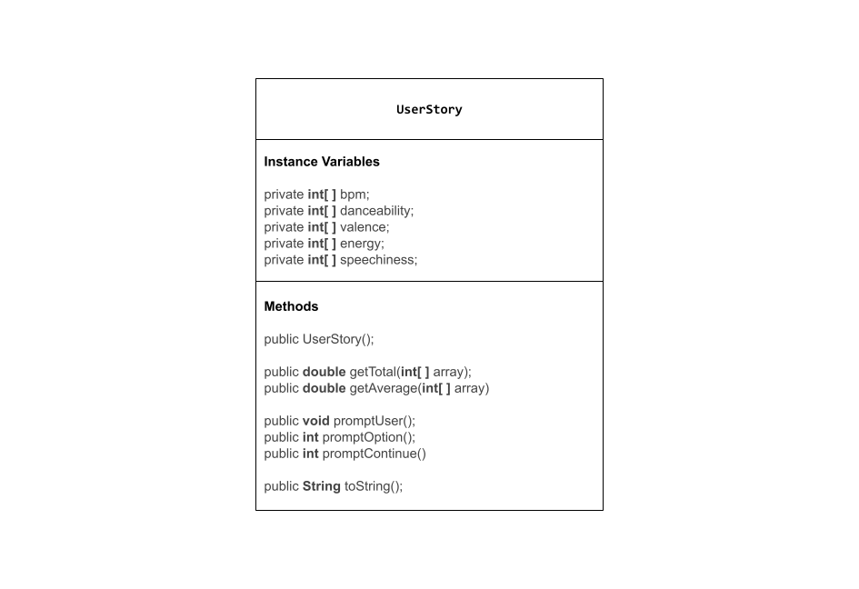

# Unit 3 - Data for Social Good Project 

## Introduction 

Software engineers develop programs to work with data and provide information to a user. Each user has different needs based on the information they are looking for from data. Your goal is to create a data analysis program for your user that stores and analyzes data to provide the information they need. 

## Requirements 

Use your knowledge of object-oriented programming, one-dimensional (1D) arrays, and algorithms to create your data analysis program: 
- **Write a class** – Write a class to represent your user or business and store and analyze their data with no-argument and parameterized constructors. 
- **Create at least two 1D arrays** – Create at least two 1D arrays to store the data that your user needs information about. 
- **Write a method** – Write a method that finds or manipulates the elements in a 1D array to provide the information your user needs. 
- **Implement a toString() method** – Write a toString() method that returns general information about the data (for example, number of values in the dataset). 
- **Document your code** – Use comments to explain the purpose of the methods and code segments and note any preconditions and postconditions. 

## User Story 

Include your User Story you analyzed for your project here. Your User Story should have the following format: 

> As an record producer,   
> I want to analyze the top songs,   
> so that I can predict what songs will become popular in the future. 

## Dataset 

Example: 

Dataset: [Most Streamed Spotify Songs 2023](https://www.kaggle.com/datasets/nelgiriyewithana/top-spotify-songs-2023)
- **bpm** (int) - beats per minute, a measure of song tempo 
- **danceability_%** (int) - percentage indicating how suitable the song is for dancing
- **valence_%** (int) - positivity of the song's musical content 
- **energy_%** (int) - perceived energy level of the song 
- **speechiness_%** (int) - amount of spoken words in the song 

## UML Diagram 

 

## Description 

I chose my dataset because it gave me key information on the top songs in 2023 which let me analyze what made songs popular. My project gave averages of the bpm, danceability, valence, energy, and speechiness of the combined top songs. This allows me to predict if a song will become popular depending on if the song has elements that are close to the averages. My project also asks for user interaction. The user is able to make choices by inputting different numbers which correspond to different options.